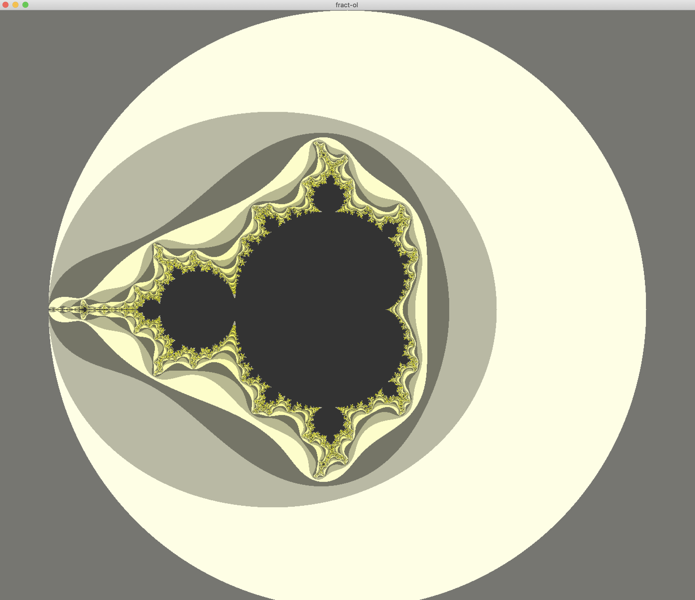
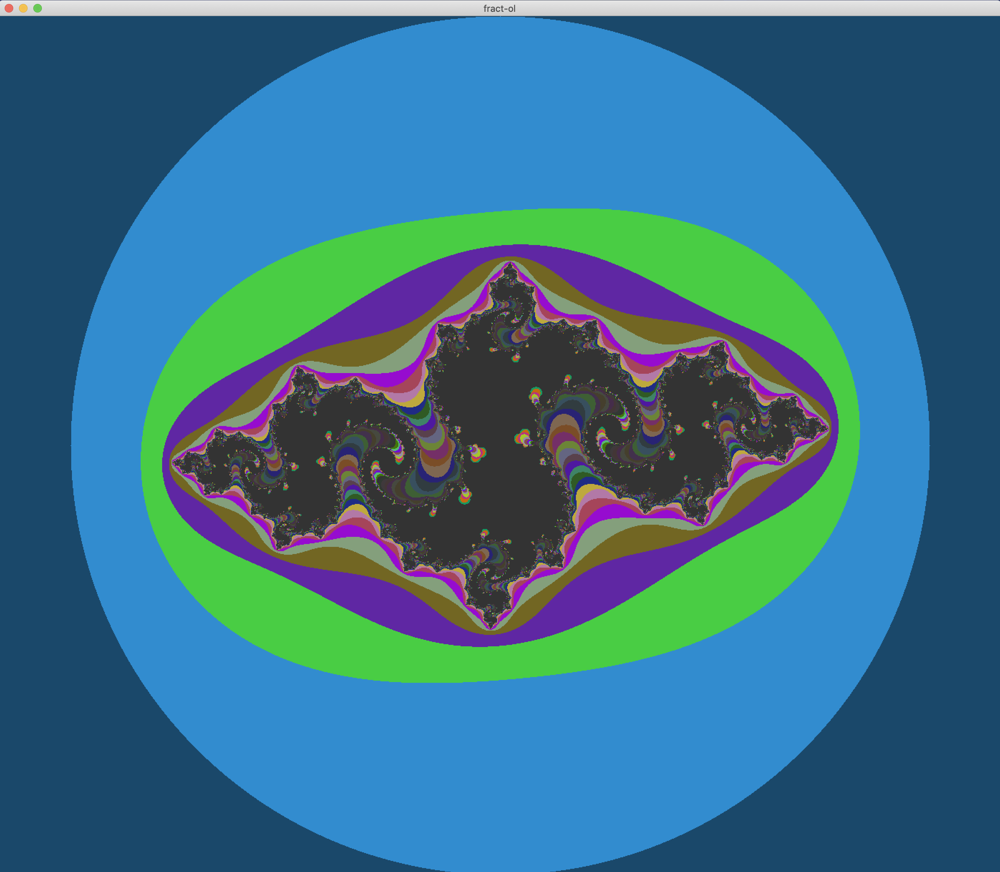

#  🎨 Fract-ol

##  📌 Overview
This project focuses on calculating and displaying fractals using the MLX42 graphics library. Explore the beauty of mathematical patterns by zooming and navigating through different fractals!

##  🚀 Usage

###  🔧 Compilation

$ make
###  🖥️ Running the Program

$ ./fractol mandelbrot    # Display the Mandelbrot set  

$ ./fractol julia         # Display the Julia set  

$ ./fractol               # See available parameters  

##  🎮 Controls
Zoom In/Out – Scroll

Move View – WASD keys

Reset View – Press R

##  🌌 Explore the Beauty of Fractals
Don't forget to play around with zoom and movement to fully explore your fractal!

##  📷 Examples

###  🔹 Mandelbrot Set

###  🔹 Julia Set

